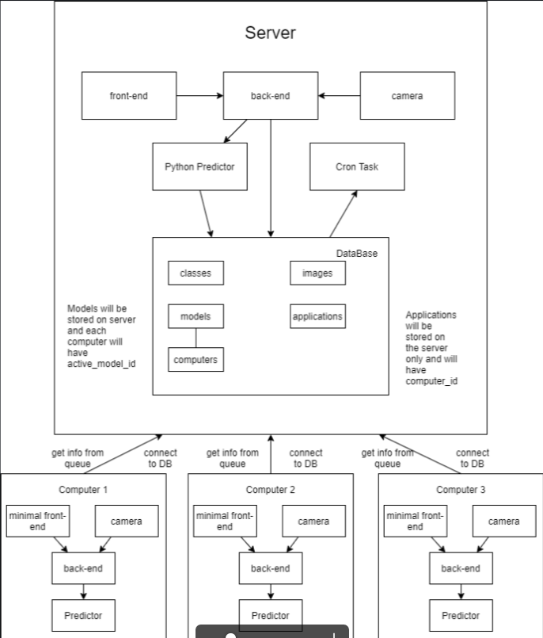

# Krack OCR `back-end`

The main `back-end` for Krack OCR system, that handle all communications with admin/classifier/SGA and handle barcodes reading

# Installation:
- git clone https://danylott@bitbucket.org/galvintec/krack_ocr_back.git
- git checkout client/server (choose here what you currently need - if not sure - choose the server)
- npm install
- nano .env (create .env file from the env.sample)
- npm start

Requires `flask-app`(python classifier) to be running

# Features:
- Node.js
- GraphQL
- Mongo
- AMQP (RabbitMQ)
- Dynamsoft.BarcodeReader

# Services:
- GraphQL API for admin and classifier communication (use localhost:4000 to test schema)
- AMQP Queue Consuming service (for communication with SGA and for client-server messaging) - 
  visit `helpers/rabbitMq.js` for more details
- `image-server` - for transporting images to front-end through http: `python3 -m http.server`

# Communications:

We have 2 kinds of RabbitMQ(AMQP) communications: with SGA(front-end for users) and with `client` computers

#### SGA:

we have 5 queues for messaging:
```javascript
  publish("session_start", {
    positionId: 1,
    supplier: "ADIDAS ESPAÑA, S.A.U.",
    brands: ["ADIDAS", "REEBOK", "ROCKPORT"],
  })
  publish("session_end", { positionId: 1 })
  publish("take_snapshot", {
    positionId: 1,
  })
  publish("recognitions", { recognition_data })
  publish("recognition_feedback", {
    recognitionId: "5f057a05f6580a1733dea2be",
    brand: "W.A.U",
    model: {
      reference: "103553",
      name: "BOHO",
      supplirReference: "WS96111",
    },
    color: "VERDE",
    size: "36",
  })
```
- "session_start" - (receive) means, that working process is started with brands and for some computer(positionId)
- "session_end" - (receive) means, that working process ends for the specific computer
- "take_snapshot" - (receive) endpoint, for taking snapshot from a local camera, process image with barcode reader 
  and classifier and send back to recognitions queue
- "recognitions" (send) - queue for sending recognitions
- "recognition_feedback" - (receive) - queue for getting feedback, if recognition was successful or not

#### `client` computers:

we have 1 queue for each computer (even for server computer also), each computer has `COMPUTER_POSITION`,
that is the same with positionId in the queues higher
The server computer will distribute incoming messages into computers queues for correct working.

```javascript
  publish(`computer_${COMPUTER_POSITION}`, { 
    topic: 'some_topic_here',
    payload,
})
```

topics:
- "session_start" - just resending "session_start", that comes from SGA to specific computer
- "session_end" - the same situation
- "take_snapshot" - resend "take_snapshot" to specific computer to use it local camera
- "restart_python_api" - due to new training or model changing we need to restart our `flask-app` - this is endpoint for it

# Architecture:

